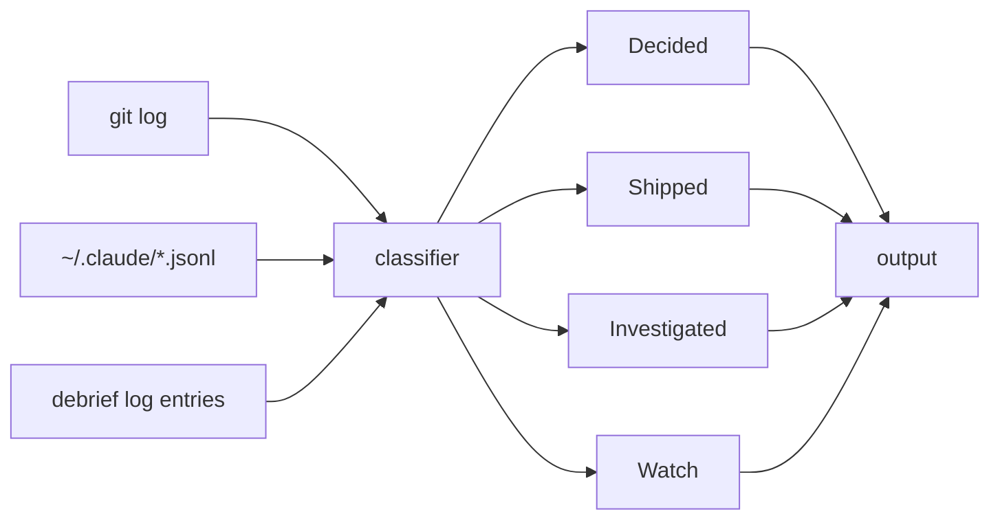

<p align="center">
  <h1 align="center">debrief</h1>
  <p align="center">What I decided, shipped, and investigated today — synthesized from git + Claude Code sessions, locally.</p>
</p>

<p align="center">
  <a href="https://github.com/cloudprobe/debrief/actions/workflows/ci.yml"></a>
  <a href="https://coveralls.io/github/cloudprobe/debrief?branch=main"></a>
  <a href="https://goreportcard.com/report/github.com/cloudprobe/debrief"></a>
  <a href="https://github.com/cloudprobe/debrief/releases/latest"></a>
  <a href="LICENSE"></a>
</p>

---

> [!IMPORTANT]
> **100% local. Zero network calls.** debrief reads your git history and Claude Code session files directly from disk. Nothing leaves your machine — no API calls, no logins, no cloud.

---

## 💡 Why debrief?

Most tools list your commits. debrief tells you what you **decided, shipped, investigated, and what to watch** — classified from git history and the context buried in your Claude Code session logs.

- Your decisions and discoveries live in `.jsonl` session files you never reread. debrief mines them.
- `git log` is a timeline, not a standup. debrief groups work by intent, not by timestamp.
- Everything runs locally: no API calls, no logins, no cloud.

Also tracks Claude API cost across direct API, Max/Pro, Vertex, and Bedrock.

---

## 🚀 Install

```sh
brew install cloudprobe/tap/debrief
```

Or with Go:

```sh
go install github.com/cloudprobe/debrief/cmd/debrief@latest
```

## Setup

```sh
debrief init
```

Choose your Claude Code access type. Config is written to `~/.config/debrief/config.yaml`.

---

## 📋 Output samples

**`debrief standup`** — grouped by intent, not timestamp:

```
Fri, Apr 18 2026

Decided
  - Dropped the Slack webhook path — too much scope for v1
  - Went with go-yaml over mapstructure for config parsing

Shipped
  - Redesigned the cost table with per-model breakdown (#12)
  - Added --project filter to standup and cost commands

Investigated
  - goreleaser's default matrix skips arm64 Linux — had to add it explicitly

Watch
  - The classifier regex is too aggressive on test: prefixes and drops real work
```

Empty sections are skipped. A day of only chore commits prints `Quiet day — just chores and lints. Nothing shipped worth writing up.` so you can tell the tool worked, the day was just quiet.

**`debrief standup --format slack`** — flat bullets for pasting:

```
`Fri, Apr 18 2026`

- Dropped the Slack webhook path — too much scope for v1
- Went with go-yaml over mapstructure for config parsing
- Redesigned the cost table with per-model breakdown (#12)
- goreleaser's default matrix skips arm64 Linux — had to add it explicitly
```

**`debrief cost week`** — per-model cost breakdown:

```
┌────────────┬──────────────────────────┬────────────┐
│ Date       │ Model                    │ Cost (USD) │
├────────────┼──────────────────────────┼────────────┤
│ 2026-04-06 │ opus 4.6                 │     $3.21  │
│            │ sonnet 4.6               │     $0.84  │
│            │ subtotal                 │     $4.05  │
├────────────┼──────────────────────────┼────────────┤
│ 2026-04-07 │ sonnet 4.6               │     $1.12  │
├────────────┼──────────────────────────┼────────────┤
│ grand total│                          │     $5.17  │
└────────────┴──────────────────────────┴────────────┘
```

---

## 🛠 Commands

| Command | Args | Description |
|---------|------|-------------|
| `debrief init` | — | Interactive setup wizard |
| `debrief standup` | `today` `yesterday` `week` `month` `-d YYYY-MM-DD` | Standup summary from commits + AI sessions |
| `debrief cost` | `today` `yesterday` `week` `month` `-d YYYY-MM-DD` | Estimated API cost with per-model breakdown |
| `debrief log` | `"message"` / `--list` | Record or list journal entries |
| `debrief version` | — | Print version |

<details>
<summary>All flags</summary>

| Flag | Commands | Description |
|------|----------|-------------|
| `--format` | `standup` | Output format: `text` (default) or `slack` |
| `--copy` | `standup`, `cost` | Copy output to clipboard |
| `--project`, `-p` | `standup`, `cost` | Filter to repos matching substring |
| `--date`, `-d` | all | Override date (YYYY-MM-DD) |

</details>

---

## ⚙️ Configuration

`~/.config/debrief/config.yaml` (respects `$XDG_CONFIG_HOME`):

```yaml
git_repo_paths:
  - ~/work
  - ~/projects
  - ~/code
git_discovery_depth: 2        # how deep to scan for git repos

pricing:
  preset: direct              # direct | max | vertex | bedrock
  overrides:
    claude-opus-4-5:
      input_per_million: 15.0
      output_per_million: 75.0

# optional overrides for AI session paths
claude_dir: ~/.claude/projects
codex_dir: ~/.codex/sessions
gemini_dir: ~/.gemini/tmp
```

---

## 🔒 How it works



The local classifier runs entirely in-process — no model calls, no network.

**Commit signal rules:**

| Commit shape | Bucket |
|--------------|--------|
| `feat`, `fix`, `perf`, `refactor`, `build`, `ci` | Shipped |
| `docs` with substantive body | Shipped |
| `chore`, `test` with a `(#N)` PR-squash suffix + substantive body | Shipped (merged via review) |
| other `chore`, `test`, short `docs` | Skipped as noise |
| any non-conventional prefix | Shipped (fallback) |
| `Merge pull request` / `Merge branch` | Shipped |

**Session note signal rules:**

| Keyword pattern | Bucket |
|-----------------|--------|
| "decided", "went with", "chose", "switched to", "picked" | Decided |
| "found", "discovered", "ruled out", "investigated", "turns out" | Investigated |
| "risk", "concern", "watch out" | Watch |
| everything else that survives quality filters | Shipped |

Output order is always: Decided → Shipped → Investigated → Watch. Empty sections are omitted.

---

## 📖 debrief log

`debrief log` lets you record short journal entries during the day that feed directly into the classifier.

```sh
# record an entry
debrief log "decided to use gRPC instead of REST"
debrief log "found that squash commits bypass prefix filter"
debrief log "concern: migration could break existing configs"

# review today's entries
debrief log --list
```

Entries are stored locally and appear in your next standup summary alongside commits and session notes. Writing entries in natural language ("decided to...", "found that...", "concern: ...") ensures they land in the right classifier bucket.

---

<details>
<summary>FAQ</summary>

**Does debrief send any data to the internet?**

No. It reads only from your local filesystem: `git log` output, `~/.claude/projects/*.jsonl` session files, and `debrief log` entries. No network calls are made at any point.

**What Claude access types are supported for cost tracking?**

Direct API, Max/Pro subscription, Vertex AI, and Amazon Bedrock. Set your type with `debrief init` or manually in `config.yaml` under `pricing.preset`.

**Why are some commits not showing up in standup?**

`chore` and `test` commits are filtered as noise by default. Short `docs` commits are too. But if a `chore(lint): ... (#42)` went through a PR and has a meaningful message, it's treated as shipped — the PR-squash suffix + substantive body combo is evidence the work was reviewed and merged. If a day ends up with only filtered commits, you'll see `Quiet day — just chores and lints` rather than the tool looking broken. Use `debrief log` to surface anything the filter drops.

**The cost table shows $0.00 for some models — is that correct?**

Zero-cost entries are filtered from the table automatically. If a model shows up with no cost (e.g. Max/Pro subscription models), it will not appear in the cost output.

**`debrief standup dsad` returned an error — is that expected?**

Yes. Unknown time-range arguments are rejected with an error listing the allowed values (`today`, `yesterday`, `week`, `month`, `-d YYYY-MM-DD`).

</details>

---

## License

MIT — see [LICENSE](LICENSE).
